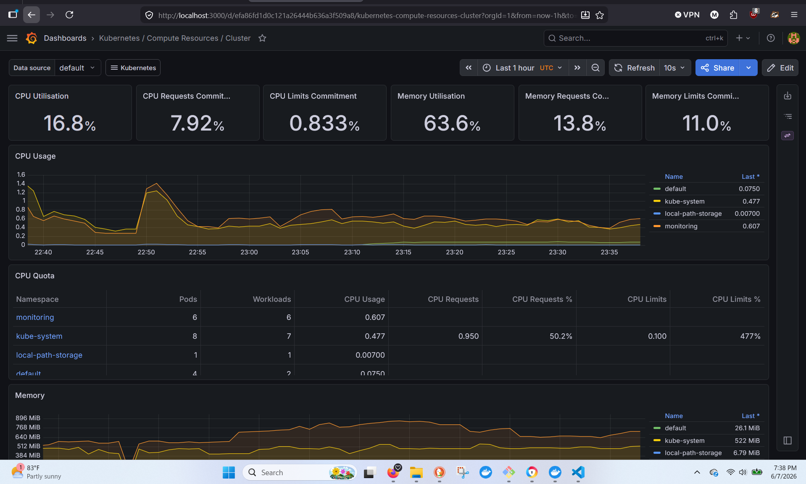
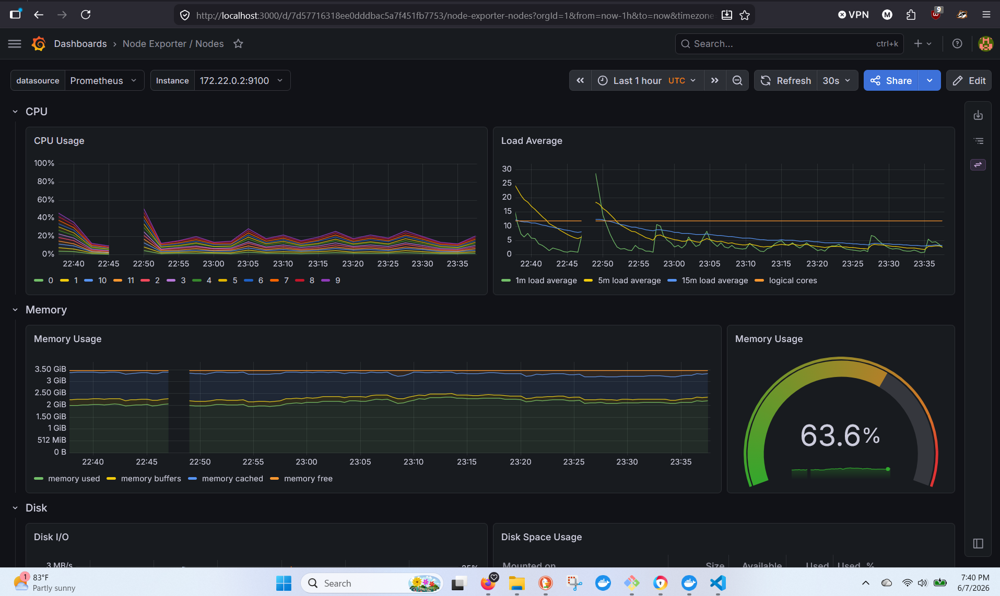
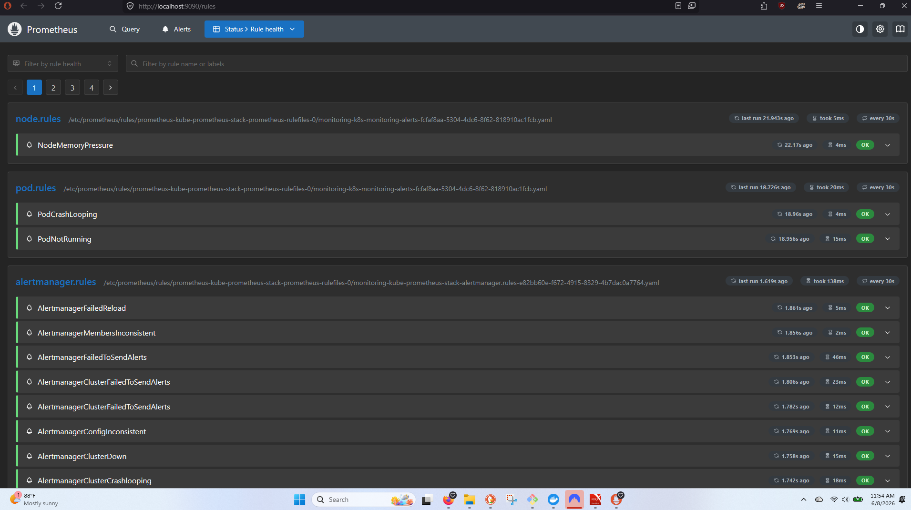
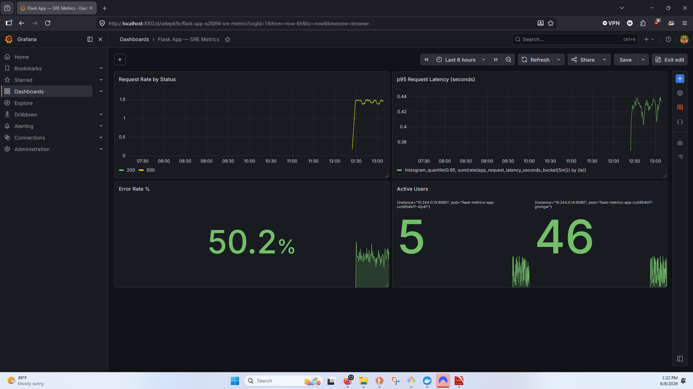

# k8s-monitoring-stack

Production-pattern Kubernetes observability stack deployed on a local kind cluster using Helm, Prometheus, Grafana, and Alertmanager. Built as a portfolio project to demonstrate SRE/DevOps skills in cluster monitoring, metrics collection, and dashboard-driven incident response.

---

## Stack Overview

| Component | Role |
|---|---|
| [kind](https://kind.sigs.k8s.io/) | Local Kubernetes cluster (Docker-based) |
| [kube-prometheus-stack](https://github.com/prometheus-community/helm-charts/tree/main/charts/kube-prometheus-stack) | Helm chart bundling Prometheus, Grafana, Alertmanager, and exporters |
| Prometheus | Metrics scraping and storage (24h retention) |
| Grafana | Dashboard visualization (30+ pre-built Kubernetes dashboards) |
| Alertmanager | Alert routing and notification pipeline |
| Node Exporter | Host-level metrics (CPU, memory, disk, network) |
| kube-state-metrics | Kubernetes object-level metrics (pod status, deployments, namespaces) |

---

## Architecture

```
kind cluster (monitoring-control-plane)
└── namespace: monitoring
    ├── prometheus-operator         # Manages Prometheus/Alertmanager lifecycle via CRDs
    ├── prometheus                  # Scrapes metrics from all cluster targets
    ├── grafana                     # Visualizes metrics; 30+ dashboards auto-provisioned
    ├── alertmanager                # Receives firing alerts from Prometheus
    ├── node-exporter               # Exposes host OS metrics
    └── kube-state-metrics          # Exposes Kubernetes API object metrics

namespace: default
    ├── nginx-demo (3 replicas)     # Sample workload under observation
    └── load-generator              # Continuous traffic generator for live metrics
```

---

## Prerequisites

- [Docker Desktop](https://www.docker.com/products/docker-desktop/) (engine running)
- [kind](https://kind.sigs.k8s.io/docs/user/quick-start/#installation) v0.23.0+
- [kubectl](https://kubernetes.io/docs/tasks/tools/) v1.32+
- [Helm](https://helm.sh/docs/intro/install/) v3.15+

---

## Quick Start

```bash
git clone https://github.com/ManuJB023/k8s-monitoring-stack.git
cd k8s-monitoring-stack
./deploy.sh
```

The script will:
1. Create a kind cluster from `cluster/kind-config.yaml`
2. Add the `prometheus-community` Helm repo
3. Deploy the full `kube-prometheus-stack` into the `monitoring` namespace

**Access Grafana:**

```bash
kubectl port-forward svc/kube-prometheus-stack-grafana 3000:80 -n monitoring
```

Open [http://localhost:3000](http://localhost:3000)

| Field | Value |
|---|---|
| Username | `admin` |
| Password | `prom-operator` |

---

## Project Structure

```
k8s-monitoring-stack/
├── cluster/
│   └── kind-config.yaml            # Kind cluster definition (pinned to k8s v1.30.0)
├── helm/
│   └── prometheus-stack/
│       └── values.yaml             # Helm overrides: resource limits, retention, passwords
├── deploy.sh                       # One-command full stack deployment
├── teardown.sh                     # Cluster teardown
└── README.md
```

---

## Key Configuration Decisions

**`cluster/kind-config.yaml`**
- Pins `kindest/node:v1.30.0` for reproducibility
- Exposes `containerPort 30000` → `hostPort 30000` for optional NodePort services

**`helm/prometheus-stack/values.yaml`**
- Prometheus retention set to `24h` (appropriate for local dev; production typically 15–30d with remote storage)
- Resource requests set explicitly to prevent unbounded memory consumption on a single-node cluster
- Grafana admin password version-controlled for demo environments (use Secrets in production)

---

## Dashboards

Pre-provisioned dashboards available immediately after deployment:

| Dashboard | What it shows |
|---|---|
| Kubernetes / Compute Resources / Cluster | Cluster-wide CPU and memory utilisation by namespace |
| Kubernetes / Compute Resources / Namespace (Pods) | Per-pod CPU, memory, and network — with live workload data |
| Node Exporter / Nodes | Host OS metrics: CPU per core, load average, memory pressure, disk I/O |
| Alertmanager / Overview | Alert ingestion rate and notification pipeline activity |

---

## Load Test (Optional)

Deploy a sample workload and generate traffic to produce meaningful dashboard data:

```bash
# Deploy nginx with 3 replicas
kubectl create deployment nginx-demo --image=nginx --replicas=3
kubectl expose deployment nginx-demo --port=80 --type=ClusterIP

# Generate continuous load
kubectl run load-generator --image=busybox --restart=Never -- \
  sh -c "while true; do wget -q -O- http://nginx-demo; sleep 0.1; done"
```

View results in **Kubernetes / Compute Resources / Namespace (Pods)** — switch namespace to `default`.

To stop:
```bash
kubectl delete pod load-generator
kubectl delete deployment nginx-demo
kubectl delete svc nginx-demo
```

---

## Teardown

```bash
./teardown.sh
```

Deletes the kind cluster and all resources. Docker images are cached locally for faster re-deployment.

---

## Why This Project

Observability is a first-class SRE discipline. In oil and gas field operations, every sensor system — downhole NMR tools, formation pressure testers, cement evaluation platforms — runs with continuous data acquisition, real-time QC thresholds, and escalation protocols when readings fall outside operational limits. This stack applies the same principle to cloud infrastructure: instrument everything, define thresholds, alert on deviation, and visualize system health for rapid incident response.

The patterns here (metrics collection → aggregation → alerting → dashboards) are directly transferable to production Kubernetes environments and industrial IoT telemetry pipelines.

---

## Next Steps

- [ ] Add custom Prometheus alerting rules (`PrometheusRule` CRD) for pod restart rate and memory pressure
- [ ] Configure Alertmanager routing to send alerts to a webhook endpoint
- [ ] Deploy a Python app with `/metrics` endpoint using the `prometheus_client` library (application-layer instrumentation)
- [ ] Add persistent volume for Prometheus storage (currently ephemeral)
- [ ] GitHub Actions workflow to validate Helm chart on push

---

## Related Projects

- [job-agent](https://github.com/ManuJB023/job-agent) — AI-powered job matching pipeline on AWS (Lambda, DynamoDB, EventBridge, SES, Terraform)
- [manuelbauka.dev](https://manuelbauka.dev) — Portfolio
---

## Screenshots

### Kubernetes / Compute Resources / Cluster


### Node Exporter / Nodes


---

## Custom Alerting Rules

Deployed via `PrometheusRule` CRD (`alerts/prometheus-rules.yaml`):

```bash
kubectl apply -f alerts/prometheus-rules.yaml
```

| Alert | Condition | Severity |
|---|---|---|
| PodCrashLooping | Pod restarts > 3 in 15 minutes | warning |
| PodNotRunning | Pod not in Running/Succeeded state for > 2 minutes | warning |
| NodeMemoryPressure | Node memory utilisation > 80% for > 2 minutes | warning |

Verify rules are loaded: `http://localhost:9090/rules` (requires Prometheus port-forward on 9090)

### Prometheus Rule Health


---

## Application-Layer Instrumentation

A Flask app (`app/`) instrumented with `prometheus_client` exposes a `/metrics` endpoint scraped by Prometheus via a `ServiceMonitor` CRD (`k8s/flask-app.yaml`).

**Metrics exposed:**

| Metric | Type | Description |
|---|---|---|
| `app_requests_total` | Counter | Total requests by method, endpoint, status |
| `app_request_latency_seconds` | Histogram | Request latency with p50/p95/p99 buckets |
| `app_active_users` | Gauge | Simulated active user count |
| `app_jobs_processed_total` | Counter | Background jobs by status |

**Key PromQL queries:**
- Request rate: `sum(rate(app_requests_total[5m])) by (status)`
- p95 latency: `histogram_quantile(0.95, sum(rate(app_request_latency_seconds_bucket[5m])) by (le))`
- Error rate: `sum(rate(app_requests_total{status="500"}[5m])) / sum(rate(app_requests_total[5m])) * 100`

### Flask App — SRE Metrics Dashboard

